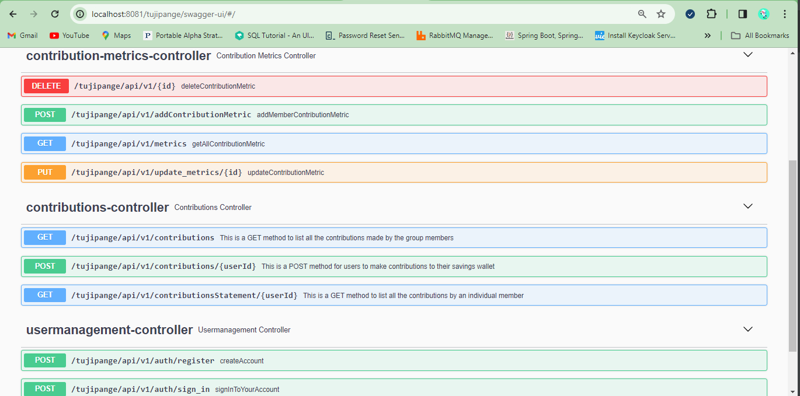

## Documentation

Tujipange High level app architecture.

#### The Apis are listed in the swagger below when you execute the App locally
#### (http://localhost:8081/tujipange/swagger-ui/)

#### Sample api list
